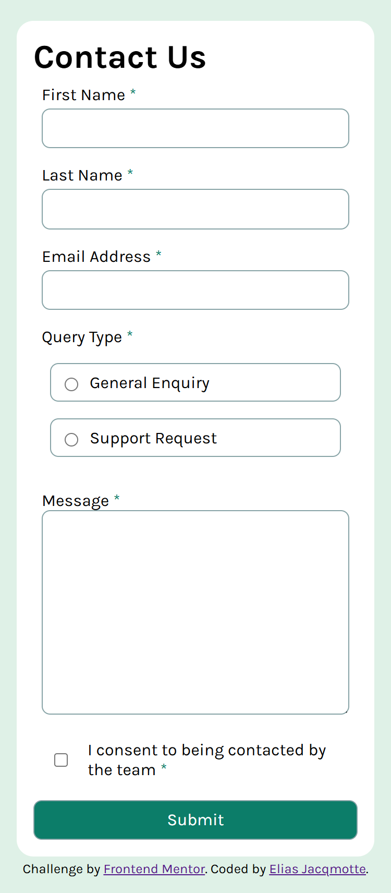
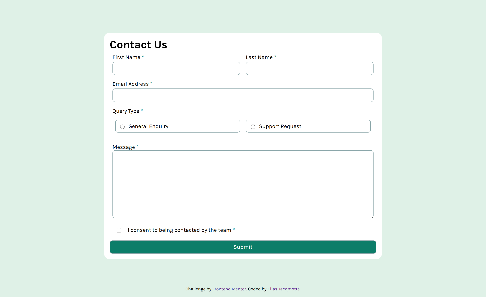
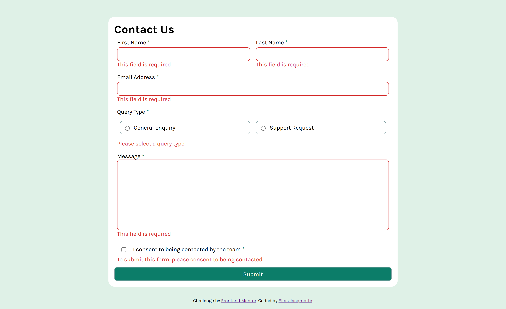
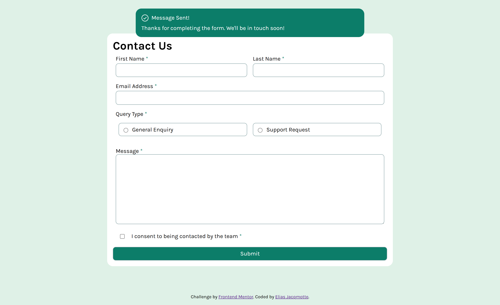

# Frontend Mentor - Contact form solution

This is a solution to the [Contact form challenge on Frontend Mentor](https://www.frontendmentor.io/challenges/contact-form--G-hYlqKJj). Frontend Mentor challenges help you improve your coding skills by building realistic projects. 

## Table of contents

- [Overview](#overview)
  - [The challenge](#the-challenge)
  - [Screenshot](#screenshot)
  - [Links](#links)
- [My process](#my-process)
  - [Built with](#built-with)
  - [What I learned](#what-i-learned)
  - [Continued development](#continued-development)
- [Author](#author)

**Note: Delete this note and update the table of contents based on what sections you keep.**

## Overview

### The challenge

Users should be able to:

- Complete the form and see a success toast message upon successful submission
- Receive form validation messages if:
  - A required field has been missed
  - The email address is not formatted correctly
- Complete the form only using their keyboard
- Have inputs, error messages, and the success message announced on their screen reader
- View the optimal layout for the interface depending on their device's screen size
- See hover and focus states for all interactive elements on the page

### Screenshot

#### Mobile layout

#### Desktop layout

#### Error state

#### Complete state

### Links

- Live Site URL: [Github pages](https://elias-jacqmotte.github.io/contact-form-vanilla/)

## My process

### Built with

- Flexbox
- CSS Grid
- Mobile-first workflow

### What I learned

That i took the wrong method at the start.  
I thought it would not have taken this much time as well:
- 1st hour focus session - Got HTML and half of CSS of mobile view
- 2nd hour focus session - Got HTML and CSS of mobile and desktop view (not active states and what not)
- 3rd hour focus session - Got mostly done, using the quick and dirty way. The toast is still what remains + clearing form.
- 20 minutes into the fourth hour focus session - Got everything done, quick and dirty way.

Total project duration: 3 hours and 30 minutes.

### Continued development

I'm going to watch the video from [Kevin Powell](https://www.youtube.com/watch?v=jJgNgNNHqjk) regarding this challenge.  
This to see what can be improved!

## Author

- Frontend Mentor - [@elias-jacqmotte](https://www.frontendmentor.io/profile/elias-jacqmotte)
